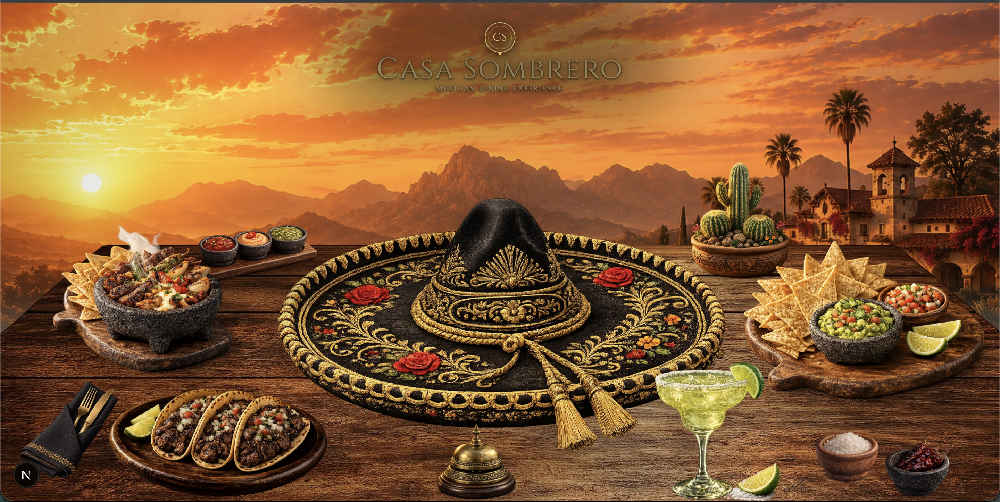
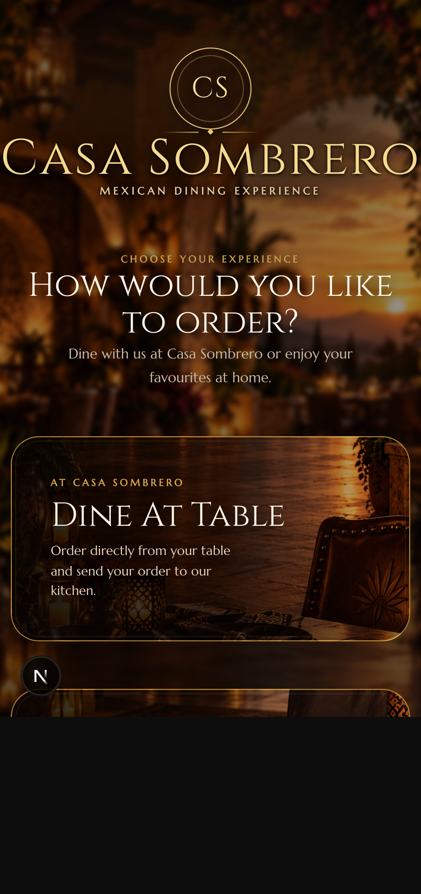

# Casa Sombrero

  <strong>An immersive digital restaurant experience combining a cinematic desktop website with a focused mobile ordering flow.</strong>

  

## Overview

Casa Sombrero was designed as an alternative to the conventional scrolling restaurant website.

The desktop experience behaves like an immersive visual scene, while mobile visitors receive a focused ordering interface designed for touch, clarity, and speed.

A single website and one domain serve both experiences.

## Experience

### Desktop

The desktop experience is built around a cinematic restaurant environment rather than stacked webpage sections.

It includes:

- Main Dishes
- Starters
- Chef's Special
- Chef Sauces
- Drinks
- Reservation
- About Casa Sombrero
- Interactive dish presentation
- Cinematic motion and transitions

### Mobile

The same website automatically presents a mobile-first ordering experience on smaller screens.

Customers can:

- Choose dine-in or delivery
- Browse the menu
- Add dishes to their cart
- Review their order
- Enter delivery details
- Use table-specific dine-in flows

  

## Responsive Strategy

Casa Sombrero uses one website and one deployment.

- **Desktop / Laptop** → immersive restaurant experience
- **Mobile** → focused ordering experience

There is no separate mobile website or secondary domain.

## Technology

Built with:

- Next.js
- React
- TypeScript
- Tailwind CSS
- Framer Motion
- GSAP
- Three.js
- React Three Fiber
- React Three Drei

## Design Direction

The desktop experience prioritizes:

- cinematic composition
- visual storytelling
- depth and atmosphere
- object-based interaction
- controlled motion
- immersive transitions

The mobile experience prioritizes:

- clarity
- touch interaction
- ordering speed
- simple navigation
- strong restaurant-brand continuity

## Architecture

The production application uses the Next.js App Router and separates the immersive desktop presentation from the transactional mobile ordering experience.

High-level documentation is available in:

- [`docs/FEATURES.md`](docs/FEATURES.md)
- [`docs/ARCHITECTURE.md`](docs/ARCHITECTURE.md)
- [`docs/DESIGN.md`](docs/DESIGN.md)
- [`docs/PUBLIC_PRIVATE_BOUNDARY.md`](docs/PUBLIC_PRIVATE_BOUNDARY.md)

## Public Showcase Boundary

This repository is a public presentation of the Casa Sombrero project.

The complete production application is maintained separately in a private repository.

This showcase intentionally does **not** contain:

- complete production source code
- proprietary implementation details
- full production assets
- internal business logic
- environment configuration
- security-sensitive documentation
- deployment internals

The public repository is intentionally not a complete buildable copy of the production application.

## Project Status

**Production application completed.**

Security review, dependency review, documentation, and deployment preparation have been completed.

## Rights

© 2026 Casa Sombrero. All rights reserved.

This showcase does not grant permission to reproduce, redistribute, resell, rebrand, commercially deploy, or commercially reuse the Casa Sombrero project.
